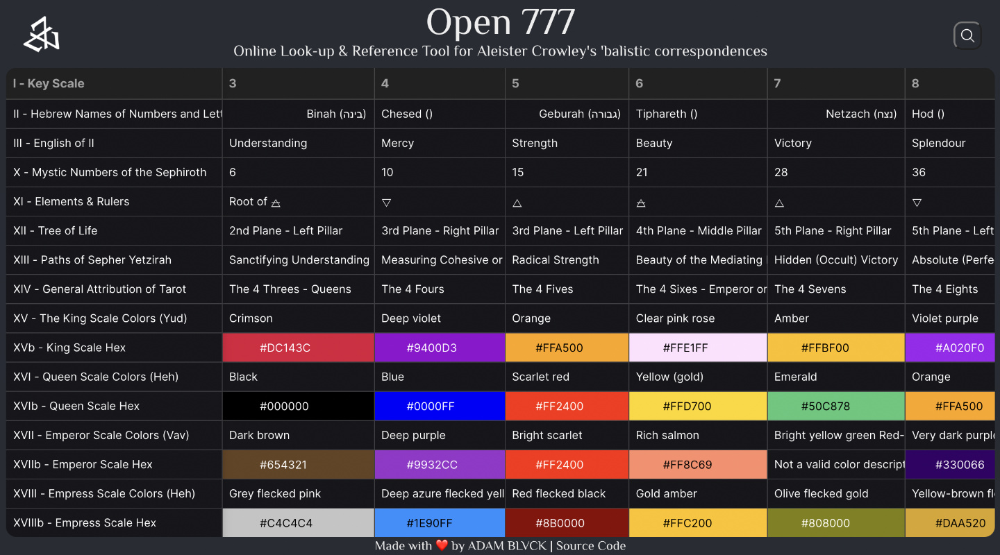

# Open 777

<p align="center">
  
</p>

### 🜁🜂 Visit [Open 777 Here](https://adamblvck.github.io/open_777/) 🜄🜃



## About

Open 777 is a small online website for easily looking up Crowley's Esoteric Kabbalistic correspondences, meant for Esoteric Study & Practice.

The website consists of transcriptions done by [ADAM BLVCK](https://adamblvck.com) from the now in open-domain book "777" by Aleister Crowley. Since looking up of correspondences in the actual book can be quite tedious, and since no courated dataset of these correspondences could be found (which in itself is a treasure mine for enhancing AI-tools), I decided to create one.

If you're looking for a way to look-up Gene Keys and IChing-based correspondences, I refer to [Gnomon](https://gnomon.adamblvck.com/).

Since 777 includes correspondences from the Kabbalistic Scale to the 64 hexagram, and the Gene Keys include correspondences to Tarot's 22 pathways, a marriage between both systems might result one day.

## The Website

In the books, the tables of correspondences is organized in 32 rows which represent the Kabbalistic scale of meaning, which spans many pages of correspondence categories. In the app a transposed approach is used, where the 32 "steps" on the scale are presented as columns, whereas the rows indicate categories.

The website uses [Glide Data Grid](https://github.com/glideapps/glide-data-grid) which is most suitable for this purpose, and includes search-functionality across the whole table.

## The Data

The to-transcribe data is huge, and thus this website will be updated every few days until all correspondences are covered. If you think you can help with transcription, please message me here or at contact@adamblvck.com.

The correspondence dataset can be found as a json object in the file `src/liber_777.js`, or `docs/liber_777.csv`, but the source of both these files is now hosted on [Google Sheets](https://docs.google.com/spreadsheets/d/1bJPN_gs6USHniUfmWFIACCroOAzOq8jX2XWITclSBA0/edit?usp=sharing). The python notebook located at `docs/convert_json.ipynb` can be used to convert a csv (exported from the Google Sheet) into an appropriate format for use in a website, or javascript environment.

### 🜁🜂 Visit [Open 777 Here](https://adamblvck.github.io/open_777/) 🜄🜃

## Publishing to GitHub Pages

To publish a new build:

```
npm install -g gh-pages --save-dev
```

Then publish through:

```
npm run deploy
```

The command above will build an optimized Standalone React Build, then commit this data the gh-pages branch. In GitHub this deployment can then be selected in Settings>Pages, allowing for free gitHub pages deployment.